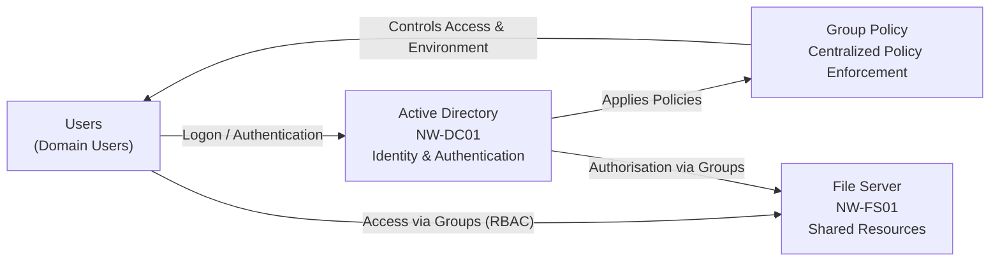

# Architecture Overview

## Overview

The Northwind Enterprise Lab simulates a mid-sized organisation with a hybrid infrastructure combining on-premises systems and future cloud integration.

The environment is designed to reflect real-world enterprise architecture, including identity management, network segmentation, policy enforcement, and controlled access to resources.

---

## Architecture Layers

The lab is structured into logical layers:

- Virtualization Layer (Proxmox)
- Network Layer (pfSense + segmented networks)
- Identity Layer (Active Directory)
- Policy & Access Layer (Group Policy + RBAC)
- File Services Layer (centralised storage)

---

## Phase 1 – Infrastructure Foundation

Phase 1 established the core infrastructure:

- Proxmox hypervisor deployed
- Virtual networking configured using bridges
- pfSense firewall/router implemented
- Network segmentation introduced:

| Network | Purpose | Subnet |
|--------|--------|--------|
| Management | Admin access | 10.10.10.0/24 |
| Server | Internal services | 10.10.20.0/24 |
| Client | End-user devices | 10.10.30.0/24 |
| DMZ | Application exposure | 10.10.40.0/24 |

This phase provided the foundation for all higher-level services.

---

## Phase 2 – Identity, Policy & Access

Phase 2 introduced centralised identity management and policy enforcement.

### Active Directory

- Domain: `northwind.local`
- Domain Controller: `NW-DC01`
- Services:
  - Active Directory Domain Services
  - DNS (AD-integrated)

Active Directory provides:
- Centralised authentication
- Authorisation
- Directory services
- Internal DNS resolution

---

### Organisational Structure

A structured OU hierarchy was implemented to reflect departmental organisation:

- Northwind Users
  - IT, HR, Finance, Engineering, Support
- Northwind Computers
  - Workstations, Servers
- Northwind Groups
- Service Accounts

---

### Identity and Access Control

Role-Based Access Control (RBAC) is used throughout the environment:
Users → Groups → Permissions

- Users are assigned to security groups
- Groups are assigned permissions to resources
- No direct user-to-resource permissions are used

---

### Group Policy

A modular Group Policy design was implemented:

| GPO | Purpose |
|-----|--------|
| NW-Security-Baseline | Password and lockout policy |
| NW-HR-Restrictions | Control Panel restriction |
| NW-RDP-Restrictions | Admin-only RDP access |
| NW-App-Control | Restrict application execution |
| NW-Drive-Mapping | Map network drives |

Policies are applied based on OU structure and user roles.

---

### File Services

A dedicated file server (`NW-FS01`) provides centralised storage:

- Base path: `C:\Shares`
- Departmental shares:
  - `\\NW-FS01\Finance`
  - `\\NW-FS01\HR`
  - `\\NW-FS01\Shared`
  - `\\NW-FS01\IT-Admin`

Access is controlled using security groups and enforced via NTFS and share permissions.

---

### DNS and DHCP Integration

A key architectural component is the separation of DHCP and DNS responsibilities:

- DHCP: pfSense
- DNS: Domain Controller (`NW-DC01`)

### Final DNS Flow
Client → Domain Controller (DNS) → pfSense → Internet

### Design Rationale

- Clients must use the Domain Controller for DNS to locate Active Directory services
- The Domain Controller forwards external queries to pfSense or upstream resolvers
- DHCP distributes DNS configuration automatically to clients

This ensures:
- Reliable domain resolution
- Successful authentication
- Proper Group Policy application

---

## Network Communication Flow

### Internal Communication
Client Network (10.10.30.0/24)
↓
pfSense (Routing + Firewall)
↓
Server Network (10.10.20.0/24)
↓
Domain Controller / File Server

### External Communication
Client → Domain Controller → pfSense → Internet

---

## Virtual Machines

| VM Name | Role |
|--------|------|
| NW-DC01 | Domain Controller (AD DS, DNS) |
| NW-FS01 | File Server |
| NW-WKS01 | Domain-joined Client |
| pfSense | Firewall, Router, DHCP |

---

## Key Design Principles

### Network Segmentation
- Separation of management, server, client, and DMZ networks
- Controlled inter-network routing via pfSense

---

### Centralised Identity
- Active Directory used as the single source of truth
- Domain-based authentication across systems

---

### Least Privilege
- Access granted via security groups
- Administrative rights restricted to IT_Admins

---

### Policy Enforcement
- Group Policy used to standardise configuration
- Role-based restrictions applied

---

### Separation of Responsibilities

| Component | Responsibility |
|----------|---------------|
| pfSense | Routing, firewall, DHCP |
| Domain Controller | Identity, authentication, DNS |
| File Server | Storage and access control |

---

## Summary

The architecture combines network segmentation, centralised identity, and policy-driven control to simulate a realistic enterprise environment.

Phase 1 established the infrastructure foundation, while Phase 2 introduced identity, access control, and operational policies.

This layered approach reflects real-world enterprise design and provides a scalable base for future phases such as cloud integration, automation, and containerised workloads.