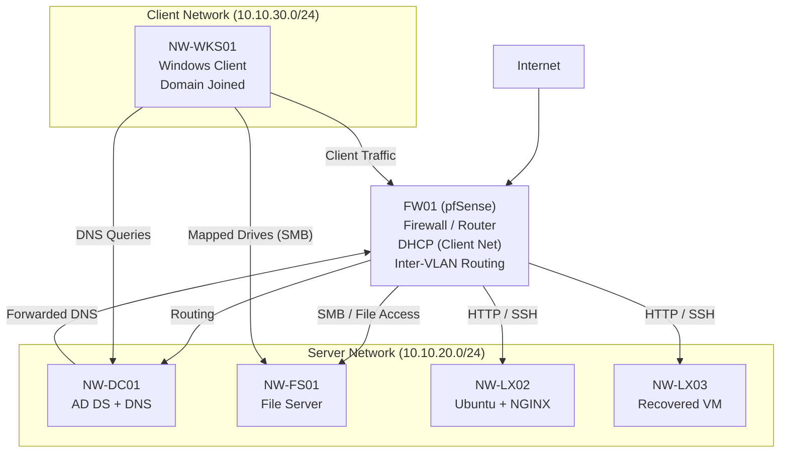

# Network Design — Northwind Enterprise Lab

## Overview

This document defines the network architecture and segmentation for the Northwind Enterprise Lab.

The network is designed to simulate a real-world enterprise environment with:

- Segmented networks for security and control  
- Centralized routing via a firewall (pfSense)  
- Controlled communication between network zones  
- Internet access via NAT  
- Centralized identity and DNS services (Active Directory)

---

## Network Architecture

The lab uses a virtualized network implemented in Proxmox using Linux bridges and pfSense.

## Core Components

Proxmox Bridges (virtual switches)
pfSense (firewall/router)
Active Directory Domain Controller (NW-DC01)
File Server (NW-FS01)
Virtual machines connected to segmented networks

## Network Segmentation

| Network | Bridge | Subnet        | Purpose                     |
| ------- | ------ | ------------- | --------------------------- |
| WAN     | vmbr0  | 192.168.x.x   | External network (home/ISP) |
| Server  | vmbr1  | 10.10.20.0/24 | Internal servers            |
| Client  | vmbr2  | 10.10.30.0/24 | User devices                |
| DMZ     | vmbr3  | 10.10.40.0/24 | Public-facing services      |

## Bridge Mapping (Proxmox)

| Bridge | Type     | Description                      |
| ------ | -------- | -------------------------------- |
| vmbr0  | External | Connected to physical NIC (nic0) |
| vmbr1  | Internal | Server network                   |
| vmbr2  | Internal | Client network                   |
| vmbr3  | Internal | DMZ network                      |

## pfSense Interface Mapping

| Interface     | Network | Purpose         |
| ------------- | ------- | --------------- |
| WAN           | vmbr0   | Internet access |
| LAN           | vmbr1   | Server network  |
| OPT1 (CLIENT) | vmbr2   | Client network  |
| OPT2 (DMZ)    | vmbr3   | DMZ network     |

## IP Addressing Scheme

| Network | Gateway    | DHCP Range                  |
| ------- | ---------- | --------------------------- |
| Server  | 10.10.20.1 | 10.10.20.100 – 10.10.20.200 |
| Client  | 10.10.30.1 | 10.10.30.100 – 10.10.30.200 |
| DMZ     | 10.10.40.1 | 10.10.40.100 – 10.10.40.200 |

## DHCP Design

DHCP is provided by pfSense for all internal networks.

Responsibilities:

Assign IP addresses to VMs
Provide default gateway (pfSense interface IP)
Provide DNS configuration

### Phase 1 Behaviour
DNS provided by pfSense resolver

### Phase 2 Enhancement
Client network receives Domain Controller (NW-DC01) as DNS server
Enables Active Directory service discovery and domain functionality

## Routing Design

pfSense acts as the central router.

Internal Routing
Routes traffic between:
Server network
Client network
DMZ

## Default Gateway

All VMs use:

Server → 10.10.20.1
Client → 10.10.30.1
DMZ → 10.10.40.1

## NAT (Network Address Translation)

pfSense performs outbound NAT:
Internal IP (10.10.x.x) → WAN IP (192.168.x.x)
This allows:
Internet access for all internal networks
Private addressing internally

Mode:
Automatic outbound NAT

## DNS Design
## Phase 1
pfSense acts as DNS resolver
VMs use pfSense as primary DNS

## Phase 2 (Active Directory Integration)
NW-DC01 provides Active Directory-integrated DNS
Domain: northwind.local

## Client DNS Configuration

Clients receive via DHCP:

DNS Server → NW-DC01 (10.10.20.x)

## DNS Resolution Flow
Client → Domain Controller (DNS)
           ↓
       pfSense / upstream DNS
           ↓
         Internet

## Key Design Principle

Domain-joined systems must use the Domain Controller as their DNS server to ensure proper Active Directory service discovery.

## Traffic Flow
## Client to Server

Client VM → pfSense → Server VM

Used for:

Domain authentication
DNS queries
File access (SMB)

## Client to Internet
Client VM → DC (DNS) → pfSense (NAT) → Internet

## Server to Internet
Server VM → pfSense (NAT) → Internet

## DMZ Access
DMZ VM → pfSense → Internet

Restricted:

DMZ → Server network (controlled)

## Firewall Rules Design
## WAN
Block inbound traffic by default

## Server (LAN)
Allow Server → any

## Client
Allow Client → Server (AD, DNS, SMB)
Allow Client → Internet

## DMZ
Allow DMZ → WAN
Restrict DMZ → internal networks

## Security Zones

| Zone   | Trust Level  |
| ------ | ------------ |
| WAN    | Untrusted    |
| DMZ    | Low trust    |
| Client | Medium trust |
| Server | High trust   |

## Network Validation

The following tests were performed:

DHCP assignment verified
Gateway reachability (ping pfSense)
Internet connectivity (ping 8.8.8.8)
DNS resolution (external and internal domain)
Domain join validation
Inter-network communication tested

## Troubleshooting Scenarios Covered
DHCP not assigning IP
Interface down after cloning
MAC address mismatch
Missing default gateway
NAT misconfiguration
DNS resolution failure (pfSense vs DC DNS)
Subnet mask misconfiguration
Inter-network connectivity issues

## Design Principles
Segmentation improves security
Firewall controls all traffic
No direct communication without rules
Internal networks use private IP space
NAT enables internet access
Identity and DNS services are centralized
Least privilege access enforced through segmentation

## Future Enhancements
VLAN implementation
Load balancing (NGINX / HAProxy)
Reverse proxy in DMZ
Zero trust segmentation
Integration with Azure networking