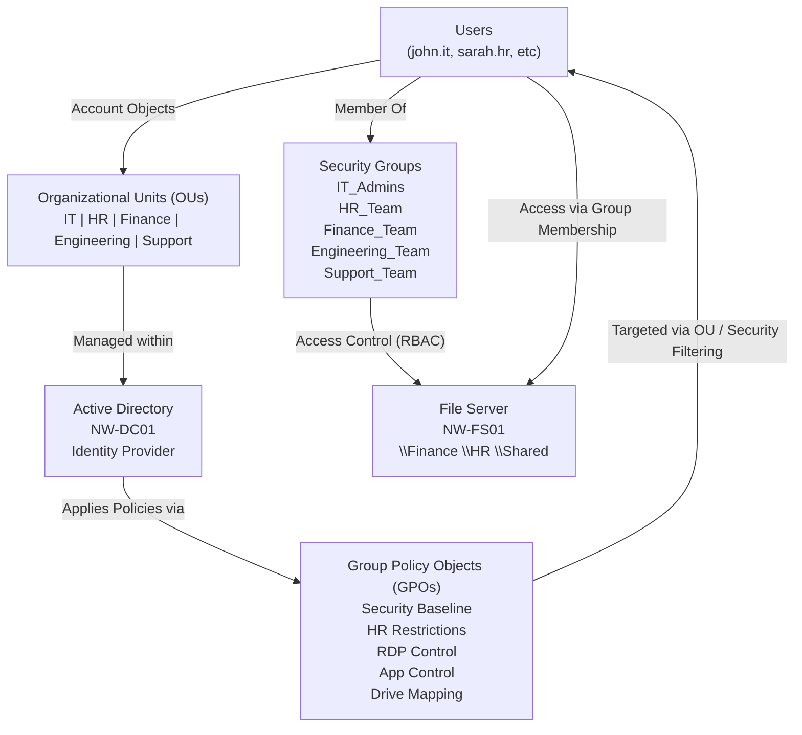

# Phase 2 – Identity, Policy & Access (Active Directory)

## Objective
The goal of Phase 2 was to implement a centralised identity and access management system using Active Directory, and to enforce organisational policies across the environment.

This phase builds on the network and virtualization foundation from Phase 1, transforming the lab into a structured enterprise-style environment.

---

## Key Components Implemented

### Active Directory Domain Services (AD DS)
- Domain created: **northwind.local**
- Domain Controller deployed on **NW-DC01**
- DNS integrated with Active Directory
- Organisational Unit (OU) structure implemented for logical user and device management

---

### Identity & Access Management

- Users created using PowerShell:
  - john.it
  - sarah.hr
  - mike.finance
  - emma.support
  - david.eng

- Security groups created:
  - IT_Admins
  - HR_Team
  - Finance_Team
  - Engineering_Team
  - Support_Team

- Group-based access control (RBAC) implemented:
  - Users assigned to role-based groups
  - Permissions managed via groups, not individual users

---

### Domain Join & Client Integration
- Workstation (**NW-WKS01**) successfully joined to domain
- Domain user login validated
- Client configuration aligned with enterprise standards (DNS, routing, authentication)

---

### Group Policy (GPO) Implementation

A structured set of Group Policies was created and applied:

#### Security Policies
- Password policy enforced (complexity, minimum length, expiry)
- Account lockout policy configured

#### User Restrictions
- Control Panel access restricted for HR users

#### Administrative Controls
- RDP access restricted to **IT_Admins**
- Application execution/install restrictions applied to standard users

#### Drive Mapping
- Network drives mapped using GPO Preferences
- Group-based targeting implemented:
  - Finance users → Finance drive
  - HR users → HR drive

---

### File Services (NW-FS01)
- Shared folders created under `C:\Shares`
- Departmental shares:
  - `\\NW-FS01\Finance`
  - `\\NW-FS01\HR`
- Permissions configured using security groups
- NTFS and share permissions aligned with least privilege principles

---

## DNS & DHCP Integration (Key Learning)

A critical part of this phase involved correctly integrating DNS with Active Directory.

### Initial Issue
- Clients were receiving DNS from pfSense
- Result: domain resolution failures and inability to locate the Domain Controller

### Solution
- DHCP (pfSense) reconfigured to assign the Domain Controller as DNS

### Final DNS Flow

Client → Domain Controller (DNS) → pfSense → Internet

This ensured:
- Proper domain resolution
- Successful domain join
- Reliable policy application

---

## Troubleshooting Highlights

Several real-world issues were encountered and resolved:

- DNS resolution failure due to incorrect DNS source
- Network connectivity issues between subnets
- Incorrect subnet mask configuration
- Understanding firewall vs routing behaviour in pfSense
- Asymmetric connectivity (client ↔ server)

These troubleshooting scenarios significantly improved understanding of:
- DNS dependency in Active Directory
- Inter-subnet routing
- Network segmentation in enterprise environments

---

## Validation

The following were successfully verified:

- Domain join completed successfully
- Domain user login functional
- GPOs applied correctly (`gpupdate`, `gpresult`)
- Network drives mapped based on group membership
- File access aligned with permissions
- DNS resolution working across networks

---

## Key Skills Demonstrated

- Active Directory administration
- DNS design and troubleshooting
- DHCP integration in segmented networks
- Group Policy design and implementation
- Role-Based Access Control (RBAC)
- File server and permissions management
- Network troubleshooting (routing, firewall, DNS)

---

## Screenshots

Screenshots for this phase are available in the `screenshots/` directory and include:

- Active Directory OU structure
- User and group configuration
- Group Policy Management Console
- File share configuration
- Drive mapping results
- Domain join validation

---

## Outcome

By the end of Phase 2, the lab evolved into a functional enterprise-style environment with:

- Centralised identity management
- Policy-driven configuration
- Role-based access control
- Integrated file services
- Proper DNS and network design

This phase bridges foundational infrastructure with real-world operational capabilities.